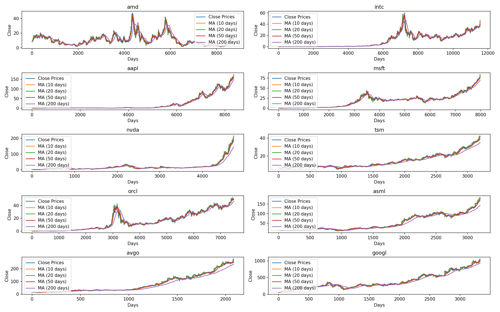
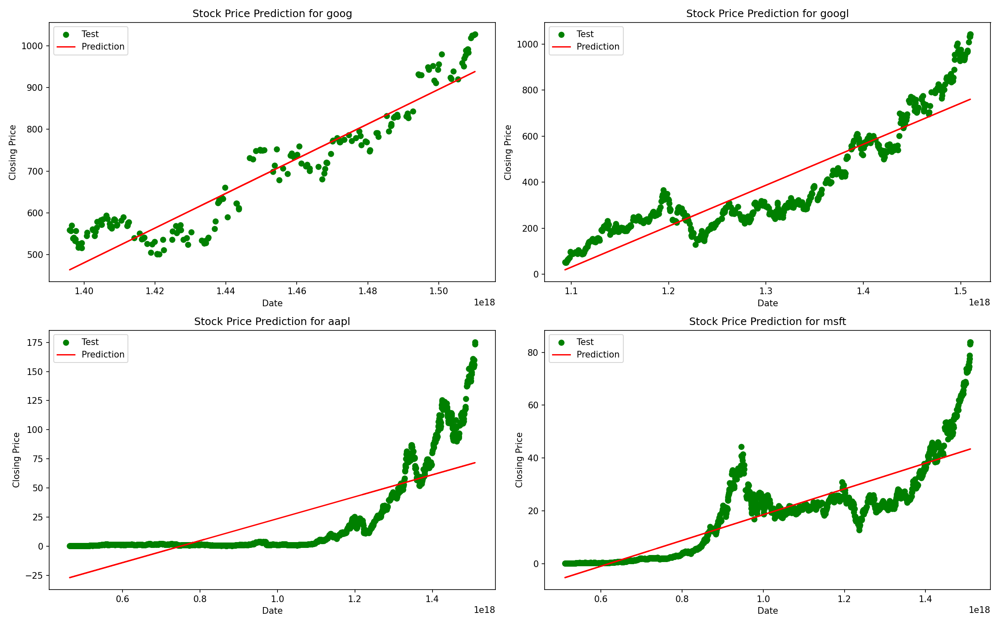

# Desafio Murano - Questão 1 - Algoritmos de Ordenação

Este é um projeto em Python que realiza algumas análises em dados de Ações. O objetivo é realizar algumas funções como médias móveis, correlaação entre preços e um modelo básico de previsão.

## Organização do Projeto

- `functions.py`: Arquivo com a implementação das funções para as tarefas requisitadas.
- `stocks.py`: Arquivo com as funções para teste e execução do teste.
- `results\`: Pasta que armazena o resultado do teste das implementações.

## Teste da Implementação

A proposta é que sejam avaliados a funcionalidade das funções implementadas. Os testes foram feitos somente nos arquivos da pasta `Stocks`. Os resultados podem ser acessados no repositório na pasta results. O teste gera gráficos de médias móveis de algumas ações, determina os pares de maior e menor correlação (**São consideradas somente 100 ações para tornar o teste mais rápido**) e gera um gráfico comparando os preços previstos em um modelo linear em comparação com os preços reais além de gerar um arquivo com os Erros Quadráticos Médios (Mean Squared Error - MSE) de algumas ações.

## Execução da Implementação

Iremos considerar um ambiente com Anaconda instalado para a realização da execução:

1. Clonar o repositório com o comando `git clone https://github.com/guilhermedionisio/MuranoQ7.git`
2. Criar um environment no Anaconda com o comando `conda create --name MuranoQ7 numpy pandas seaborn matplotlib sklearn`
3. Ativar o environment com `conda activate MuranoQ7`
4. Copiar a pasta Stocks para o repositório, entrar no repositório e executar o comando `python stocks.py`
5. Ao fim da execução, os resultados ficam armazenados na pasta `results`

## Resultados Gerados

São gerados alguns arquivos para testar a implementação:

### Médias Móveis

Foram escolhidos 10 ações para a realização do teste da função de médias móveis:

Nesses Gráficos é possível perceber o efeito do aumento das janelas de médias móveis nos preços. Para ações com poucas variações significativas em curtos períodos de tempo, as médias móveis independente do tamanho da janela se mantém próximas ao preço real. Essa situação é perceptível no gráfico da Microsoft (msft).

Porém, em um cenário de variações grandes e rápidas, janelas de tempo grandes não representam bem essas mudanças. O gráfico da AMD (amd) é o que melhor representa isso sendo possível ver que a janela de 200 dias possui um descolamento significativo do valor real em situações de picos.

Portanto, caso o interesse seja identificar movimentos de curto prazo janelas mais curtas são mais interessantes enquanto que, para analisar tendências ao longo prazo, desprezando variações atípicas, janelas maiores são melhores.

### Correlação das ações

Foram escolhidos 100 elementos da pasta Stocks e foi calculada a correlação entre esses elementos com o objetivo de encontrar as 5 maiores e menores correlação entre ações. Os resultados estão armazenados no seguinte arquivo:

`correlationsItemB.txt`: Arquivo com as maiores e menores correlações entre o preço de fechamento de algumas ações.

Top correlations:

| Stock Pair | Correlation |
|------------|-------------|
| adxs - adxsw |  0.994 |
| agn - agn_a |  0.992 |
| aed - aeh | 0.990 |
| aed - afc |  0.989 |
| afsd - agiil | 0.982 |

Bottom correlations:

| Stock Pair | Correlation |
|------------|-------------|
| adro - agncn | -0.926 |
| aee - aemd | -0.918 |
| aemd - afc |  -0.918 |
| aeis - aemd | -0.917|
| aemd - agm | -0.917 |

Fica evidente pelos Tickers que as maiores correlações ocorrem em ações da mesma empresa/organização que é um resultado esperado dado que, elas representam ativos iguais ou similares. Não consegui encontrar relações entre as ações com correlações inversas porém, é interessante notar que a ação AEMD, uma empresa do setor da saúde,  aparece em 4 das 5 linhas indicando que ela, provavelmente, em um momento de crescimento significativo de um setor específico do mercado teve quedas significativas. Essa suposição partiu do fato de que as ações AEE, AEIS e AFC são de empresas do setor de energia.

### Previsão dos Preços das Ações

Foram escolhidas 4 ações para treinar um modelo de Regressão Lienar e avaliar sua previsão além disso, os resultados de erro foram armazenados no seguinte arquivo:

- `mseItemC.txt`: Arquivo com os Erros Quadráticos Médios dos valores previstos do modelo em comparação com o valor real.

| Tickers | MSE      |
|---------|----------|
| goog    | 2613.10  |
| googl   | 9778.59  |
| aapl    | 610.37   |
| msft    | 70.59    |

É possível perceber que o modelo de Regressão Linear é incapaz de modelar o comportamento do preço de uma ação porém, ele serve como um indicativo simples da tendência de longo prazo do preço. Comparar os valores de MSE diretamente nesse caso não é o ideal dado que, os preços das ações estão em ordens de grandeza diferentes porém, é evidente através do gráfico que o erro seria significativo porque uma reta é incapaz de representar as variações dos preços.